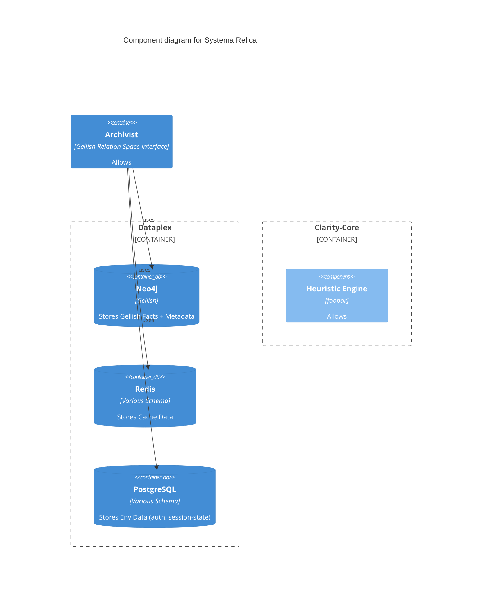

# Overview

## Quintessential Semantic Modelling

## Architectural Components

    <!-- Rel(clarityCore, env, "uses") -->
    <!-- Rel(clarityCore, archivist, "uses") -->
### Dataplex

Graph Database

Cache

### Archivist

Interface to Graph Database and Cache's

Provides API access to Semantic Model Relation-Space

*Auth

*Access Control

### The Clarity Core

Interface to Semantic Model Relation-Space(Archivist)

Provides runtime configurable mapping layer between Semantic Model Entities and users Application Domain (GraphQL)

#### Heuristic Engine

Stack-based recursively-calling heirarchical-state-machine management sub-component

Alongside comprehensive set of HSM definitions comprising essential Quintessential Modelling Heuristics

The term 'Heuristic' meaning our HSM definitions/interpretation specifically purposed for stepping through complex operations over the Semantic Model
