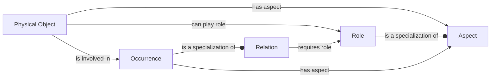
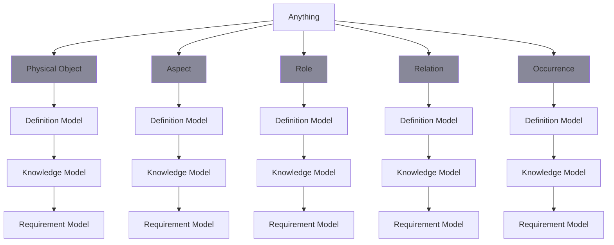

# Quintessential Semantic Modelling

    The Semantic Model is focused mainly on describing facts about Physical Objects.  To enable this comprehensively there are 5 major categories of Kinds of things allowed to be expressed in the Semantic Model.

    - **Physical Object** - is a whole individual thing that is a distribution of matter or energy in time and space that satisfies the laws of physics. All kinds of physical objects are subtypes of this class. It is the top of the hierarchical network of specializations of kinds of physical objects.
    - **Aspect** - is an individual object that is a phenomenon that is possessed by a totality and cannot exist without the existence of its possessor. It is an intrinsic, non-separable facet of its possessor.
    - **Role** - is an aspect that is what is played by an individual object in an activity or in a fact.
    - **Relation** - is a single object that indicates that a number of things have something to do with each other. It is an expression of a single fact. If one of the related things is a plurality, then the relation implies multiple facts.
    - **Occurrence** - is a state that is dynamic and is an interaction over time between involved things, each with its own role.
    
    Which interelate through this fundamental orientation:

    
    That each Kind must specialize a prexisting Kind it is implied that all Models in the Semantic Space are specializations of (sub components of) the above pattern.
    
    For each of the 5 categories of Kinds of things the semanitc modell allows expressing 3 levels of information about each as follows:
    
    - **Definition Model** - facts which specify what 'by definition' must be the case
    - **Knowledge Model** - facts which specify what 'can be' the case
    - **Requirements Model** - which specify what 'shall be' the case within a given context

    Thus

    Additionally the Semantic Model also enables description of Collections of things.
