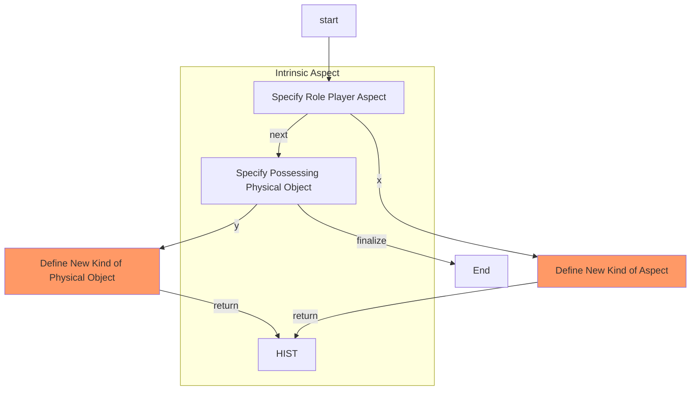

# Aspect Definition Modelling

```mermaid
flowchart TD
    SRPA[Specify Role Player Aspect]
    SPPO[Specify Possessing Physical Object]
    DNKPO[Define New Kind of Physical Object]
    DNKA[Define New Kind of Aspect]
    HIST
    E[End]

    start --> SRPA
    subgraph IA[Intrinsic Aspect]
        SRPA -->|next| SPPO
        HIST
    end

    SPPO -->|y| DNKPO
    DNKPO:::external -->|return| HIST
    SRPA -->|x| DNKA
    DNKA:::external -->|return| HIST
    SPPO -->|finalize| E
    
    click DNKA "/docs/design/theory/quintessential-modelling/modelling-procedures/aspect-definition-model" "This is a tooltip for a link"
    click DNKPO "/docs/design/theory/quintessential-modelling/modelling-procedures/physical-object-definition-model" "This is a tooltip for a link"
    
    classDef external fill:#f96
```
