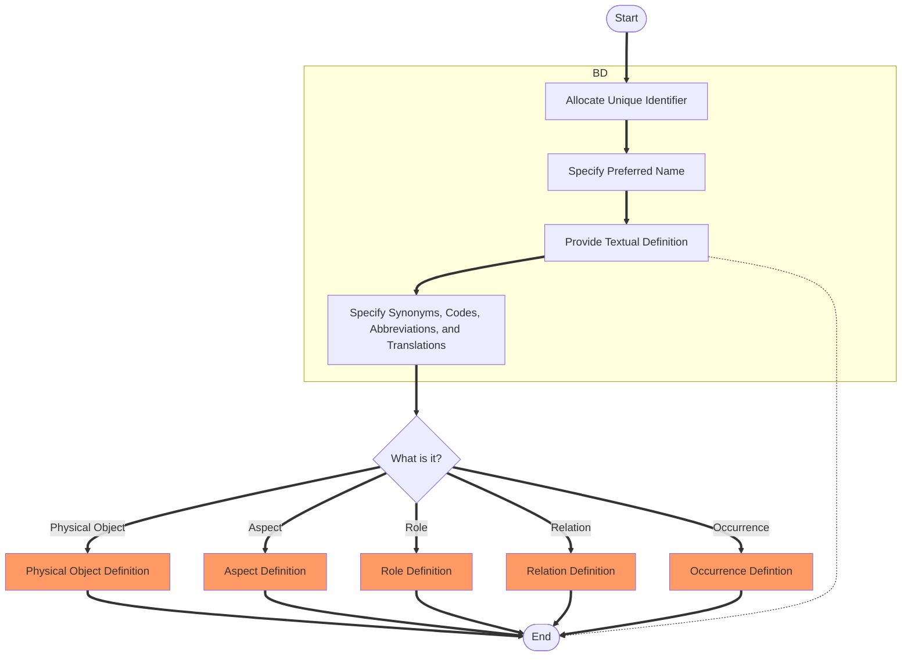

# Base Definition

```mermaid
flowchart TD
    AUID[Allocate Unique Identifier]
    SPN[Specify Preferred Name]
    PTD[Provide Textual Definition]
    SSCAT[Specify Synonyms, Codes, Abbreviations, and Translations]
    PO[Physical Object Definition]
    A[Aspect Definition]
    RO[Role Definition]
    RE[Relation Definition]
    O[Occurrence Defintion]
    E([End])

    S([Start]) ==> AUID
    subgraph BD
        AUID ==> SPN
        SPN ==> PTD
        PTD ==> SSCAT
    end
    SSCAT ==> B{What is it?}
    B ==>|Physical Object| PO
    B ==>|Aspect| A 
    B ==>|Role| RO
    B ==>|Relation| RE
    B ==>|Occurrence| O 
    PO:::external ==> E
    A:::external ==> E
    RO:::external ==> E
    RE:::external ==> E
    O:::external ==> E
    PTD -.-> E

    click PO "/docs/design/theory/quintessential-modelling/modelling-procedures/physical-object-definition-model" "This is a tooltip for a link"
    click A "/docs/design/theory/quintessential-modelling/modelling-procedures/aspect-definition-model" "This is a tooltip for a link"
    click RO "/docs/design/theory/quintessential-modelling/modelling-procedures/role-definition-model" "This is a tooltip for a link"
    click RE "/docs/design/theory/quintessential-modelling/modelling-procedures/relation-definition-model" "This is a tooltip for a link"
    click O "/docs/design/theory/quintessential-modelling/modelling-procedures/occurrence-definition-model" "This is a tooltip for a link"
    
    classDef external fill:#f96
```
