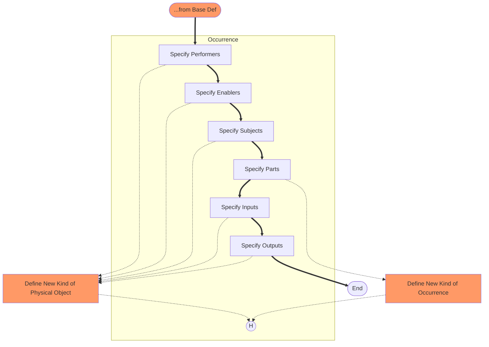

# Occurrence Definition Modelling

**TBH, the following is mostly _knowledge model_ of occurrence

```mermaid
flowchart TD
    S([...from Base Def])
    SPerf[Specify Performers]
    SE[Specify Enablers]
    SS[Specify Subjects]
    SParts[Specify Parts]
    SI[Specify Inputs]
    SO[Specify Outputs]

    DNKPO[Define New Kind of Physical Object]
    DNKO[Define New Kind of Occurrence]
    HIST((H))
    E([End])
    
    S:::external ==> SPerf
    subgraph Occurrence
        SPerf ==> SE
        SE ==> SS
        SS ==> SParts
        SParts ==> SI
        SI ==> SO
        HIST
    end
    
    SPerf -.-> DNKPO
    SE -.-> DNKPO
    SS -.-> DNKPO
    SParts -.-> DNKO
    SI -.-> DNKPO
    SO -.-> DNKPO

    DNKPO:::external -.-> HIST
    DNKO:::external -.-> HIST
    
    SO ==> E

    click S "/docs/design/theory/quintessential-modelling/modelling-procedures/base-definition-model" "This is a tooltip for a link"
    click DNKPO "/docs/design/theory/quintessential-modelling/modelling-procedures/physical-object-definition-model" "This is a tooltip for a link"
    click DNKO "/docs/design/theory/quintessential-modelling/modelling-procedures/occurrence-definition-model" "This is a tooltip for a link"

    
    classDef external fill:#f96
```
