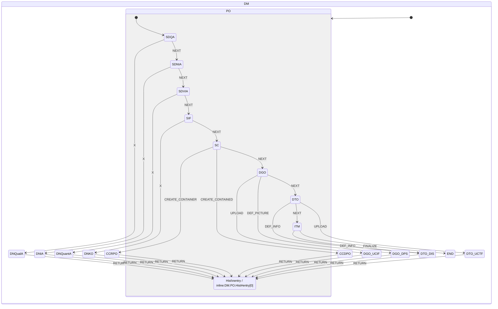
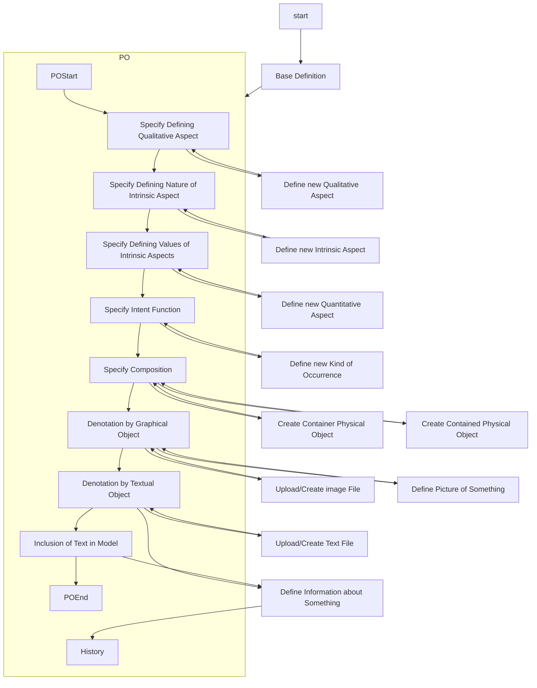

# Definition Modelling

```mermaid
%% Generated with Stately Studio
stateDiagram-v2
  state "DM" as DM {
    [*] --> DM.PO
    DM.PO.SDQA --> DM.DNQualA : X
    DM.PO.SDNIA --> DM.DNIA : X
    DM.PO.SDVIA --> DM.DNQuantA : X
    DM.PO.SIF --> DM.DNKO : X
    DM.PO.SC --> DM.CCRPO : CREATE_CONTAINER
    DM.PO.SC --> DM.CCDPO : CREATE_CONTAINED
    DM.PO.DGO --> DM.DGO_UCIF : UPLOAD
    DM.PO.DGO --> DM.DGO_DPS : DEF_PICTURE
    DM.PO.DTO --> DM.DTO_UCTF : UPLOAD
    DM.PO.DTO --> DM.DTO_DIS : DEF_INFO
    DM.PO.ITM --> DM.END : FINALIZE
    DM.PO.ITM --> DM.DTO_DIS : DEF_INFO
    DM.DNQualA --> DM.PO.Hist : RETURN
    DM.DNIA --> DM.PO.Hist : RETURN
    DM.DNQuantA --> DM.PO.Hist : RETURN
    DM.DNKO --> DM.PO.Hist : RETURN
    DM.CCRPO --> DM.PO.Hist : RETURN
    DM.CCDPO --> DM.PO.Hist : RETURN
    DM.DGO_UCIF --> DM.PO.Hist : RETURN
    DM.DGO_DPS --> DM.PO.Hist : RETURN
    DM.DTO_DIS --> DM.PO.Hist : RETURN
    DM.DTO_UCTF --> DM.PO.Hist : RETURN
        state "PO" as DM.PO {
            [*] --> DM.PO.SDQA
            DM.PO.SDQA --> DM.PO.SDNIA : NEXT
            DM.PO.SDNIA --> DM.PO.SDVIA : NEXT
            DM.PO.SDVIA --> DM.PO.SIF : NEXT
            DM.PO.SIF --> DM.PO.SC : NEXT
            DM.PO.SC --> DM.PO.DGO : NEXT
            DM.PO.DGO --> DM.PO.DTO : NEXT
            DM.PO.DTO --> DM.PO.ITM : NEXT
            state "SDQA" as DM.PO.SDQA
            state "SDNIA" as DM.PO.SDNIA
            state "SDVIA" as DM.PO.SDVIA
            state "SIF" as DM.PO.SIF
            state "SC" as DM.PO.SC
            state "DGO" as DM.PO.DGO
            state "DTO" as DM.PO.DTO
            state "ITM" as DM.PO.ITM
            state "Hist\nentry / inline:DM.PO.Hist#entry[0]" as DM.PO.Hist
        }
    state "END" as DM.END
    state "DNQualA" as DM.DNQualA
    state "DNIA" as DM.DNIA
    state "DNQuantA" as DM.DNQuantA
    state "DNKO" as DM.DNKO
    state "CCRPO" as DM.CCRPO
    state "CCDPO" as DM.CCDPO
    state "DGO_UCIF" as DM.DGO_UCIF
    state "DGO_DPS" as DM.DGO_DPS
    state "DTO_DIS" as DM.DTO_DIS
    state "DTO_UCTF" as DM.DTO_UCTF
  }

  
```

```mermaid
flowchart TD
    BD[Base Definition]
    PO.SDQA[Specify Defining Qualitative Aspect]
    DNQualA[Define new Qualitative Aspect]
    PO.SDNIA[Specify Defining Nature of Intrinsic Aspect]
    DNIntrA[Define new Intrinsic Aspect]
    SDVIA[Specify Defining Values of Intrinsic Aspects]
    DNQuantA[Define new Quantitative Aspect]
    PO.SIF[Specify Intent Function]
    DNKO[Define new Kind of Occurrence]
    PO.SC[Specify Composition]
    CCrPO[Create Container Physical Object]
    CCdPO[Create Contained Physical Object]
    DGO[Denotation by Graphical Object]
    DGO_UCIF[Upload/Create image File]
    DGO_DPS[Define Picture of Something]
    PO.DTO[Denotation by Textual Object]
    DTO_UCTF[Upload/Create Text File]
    DTO_DIS[Define Information about Something]
    PO.ITM[Inclusion of Text in Model]
    PO.H[History]

    start --> BD
    BD --> PO
    subgraph PO
        PO.H
        POStart --> PO.SDQA
        PO.SDQA --> PO.SDNIA
        PO.SDNIA --> SDVIA
        SDVIA --> PO.SIF
        PO.SIF --> PO.SC
        PO.SC --> DGO
        DGO --> PO.DTO
        PO.DTO --> PO.ITM
        PO.ITM --> POEnd
    end
    PO.SDQA --> DNQualA
    DNQualA --> PO.SDQA
    PO.SDNIA --> DNIntrA
    DNIntrA --> PO.SDNIA
    SDVIA --> DNQuantA
    DNQuantA --> SDVIA
    PO.SIF --> DNKO
    DNKO --> PO.SIF
    PO.SC --> CCrPO
    CCrPO --> PO.SC
    PO.SC --> CCdPO
    CCdPO --> PO.SC
    DGO --> DGO_UCIF
    DGO_UCIF --> DGO
    DGO --> DGO_DPS
    DGO_DPS --> DGO
    PO.DTO --> DTO_UCTF
    DTO_UCTF --> PO.DTO
    PO.DTO --> DTO_DIS
    DTO_DIS --> PO.H
    PO.ITM --> DTO_DIS

    click PO.SDQA "https://www.github.com" "This is a tooltip for a link"
```
