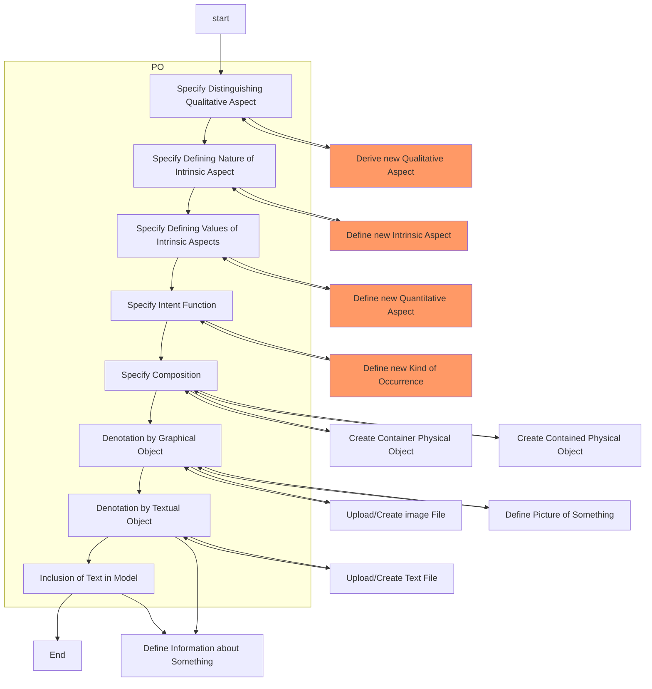

# Physical Object Definition Modelling
basis, bumpX, bumpY, cardinal, catmullRom, linear, monotoneX, monotoneY, natural, step, stepAfter, and stepBefore

```mermaid
flowchart TB
    PO.SDQA[Specify Distinguishing Qualitative Aspect]
    DNQualA[Derive new Qualitative Aspect]
    PO.SDNIA[Specify Defining Nature of Intrinsic Aspect]
    DNIntrA[Define new Intrinsic Aspect]
    SDVIA[Specify Defining Values of Intrinsic Aspects]
    DNQuantA[Define new Quantitative Aspect]
    PO.SIF[Specify Intent Function]
    DNKO[Define new Kind of Occurrence]
    PO.SC[Specify Composition]
    CCrPO[Create Container Physical Object]
    CCdPO[Create Contained Physical Object]
    DGO[Denotation by Graphical Object]
    DGO_UCIF[Upload/Create image File]
    DGO_DPS[Define Picture of Something]
    PO.DTO[Denotation by Textual Object]
    DTO_UCTF[Upload/Create Text File]
    DTO_DIS[Define Information about Something]
    PO.ITM[Inclusion of Text in Model]
    E[End]

    start --> PO.SDQA
    subgraph PO
        PO.SDQA --> PO.SDNIA
        PO.SDNIA --> SDVIA
        SDVIA --> PO.SIF
        PO.SIF --> PO.SC
        PO.SC --> DGO
        DGO --> PO.DTO
        PO.DTO --> PO.ITM
    end
    PO.ITM --> E
    PO.SDQA --> DNQualA
    DNQualA:::external --> PO.SDQA
    PO.SDNIA --> DNIntrA
    DNIntrA:::external --> PO.SDNIA
    SDVIA --> DNQuantA
    DNQuantA:::external --> SDVIA
    PO.SIF --> DNKO
    DNKO:::external --> PO.SIF
    PO.SC --> CCrPO
    CCrPO --> PO.SC
    PO.SC --> CCdPO
    CCdPO --> PO.SC
    DGO --> DGO_UCIF
    DGO_UCIF --> DGO
    DGO --> DGO_DPS
    DGO_DPS --> DGO
    PO.DTO --> DTO_UCTF
    DTO_UCTF --> PO.DTO
    PO.DTO --> DTO_DIS
    PO.ITM --> DTO_DIS

    click DNQualA "/docs/design/theory/quintessential-modelling/modelling-procedures/aspect-definition-model" "This is a tooltip for a link"
    click DNIntrA "/docs/design/theory/quintessential-modelling/modelling-procedures/aspect-definition-model"
    click DNQuantA "/docs/design/theory/quintessential-modelling/modelling-procedures/aspect-definition-model"
    click DNKO "/docs/design/theory/quintessential-modelling/modelling-procedures/occurrence-definition-model"
    
    classDef external fill:#f96
```
