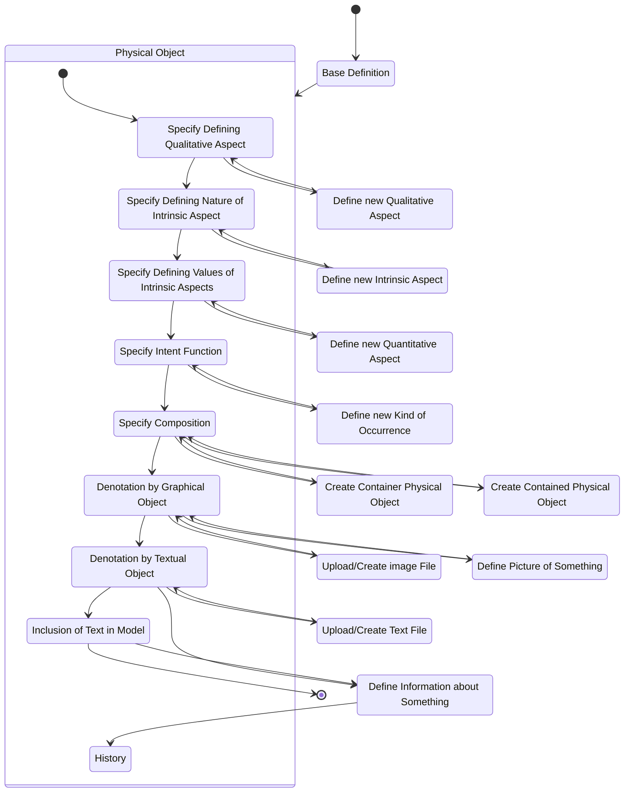

# Definition Modelling

```mermaid
stateDiagram-v2
    BD: Base Definition
    PO: Physical Object
    PO.SDQA: Specify Defining Qualitative Aspect 
    DNQualA: Define new Qualitative Aspect
    PO.SDNIA: Specify Defining Nature of Intrinsic Aspect
    DNIntrA: Define new Intrinsic Aspect
    SDVIA: Specify Defining Values of Intrinsic Aspects
    DNQuantA: Define new Quantitative Aspect
    PO.SIF: Specify Intent Function
    DNKO: Define new Kind of Occurrence
    PO.SC: Specify Composition
    CCrPO: Create Container Physical Object
    CCdPO: Create Contained Physical Object
    DGO: Denotation by Graphical Object
    DGO_UCIF: Upload/Create image File
    DGO_DPS: Define Picture of Something
    PO.DTO: Denotation by Textual Object
    DTO_UCTF: Upload/Create Text File
    DTO_DIS: Define Information about Something
    PO.ITM: Inclusion of Text in Model
    PO.H: History

    [*] --> BD
    BD --> PO
    state PO {
        PO.H
        [*] --> PO.SDQA
        PO.SDQA --> PO.SDNIA
        PO.SDNIA --> SDVIA
        SDVIA --> PO.SIF
        PO.SIF --> PO.SC
        PO.SC --> DGO
        DGO --> PO.DTO
        PO.DTO --> PO.ITM
    }
    PO.SDQA --> DNQualA
    DNQualA --> PO.SDQA
    PO.SDNIA --> DNIntrA
    DNIntrA --> PO.SDNIA
    SDVIA --> DNQuantA
    DNQuantA --> SDVIA
    PO.SIF --> DNKO
    DNKO --> PO.SIF
    PO.SC --> CCrPO
    CCrPO --> PO.SC
    PO.SC --> CCdPO
    CCdPO --> PO.SC
    DGO --> DGO_UCIF
    DGO_UCIF --> DGO
    DGO --> DGO_DPS
    DGO_DPS --> DGO
    PO.DTO --> DTO_UCTF
    DTO_UCTF --> PO.DTO
    PO.DTO --> DTO_DIS
    DTO_DIS --> PO.H
    PO.ITM --> DTO_DIS
    PO.ITM --> [*]
```
