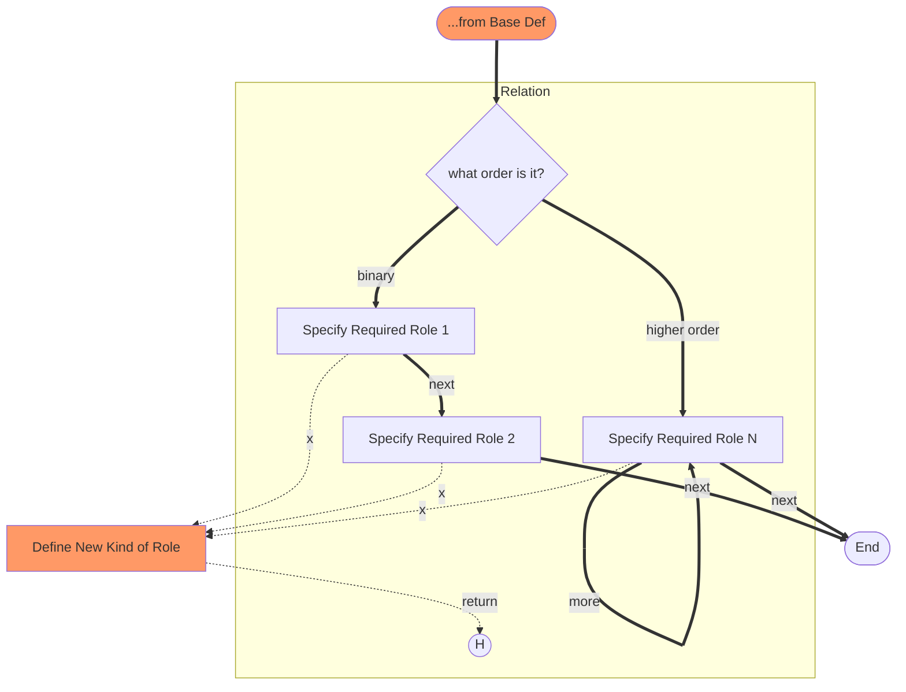

# Relation Definition Modelling

```mermaid
flowchart TD
    BD([...from Base Def])
    SRR1[Specify Required Role 1]
    SRR2[Specify Required Role 2]
    SRRN[Specify Required Role N]
    DNKR[Define New Kind of Role]
    HIST((H))
    E([End])

    BD:::external ==> Q{what order is it?}
    subgraph Relation
        Q ==>|binary| SRR1
        SRR1 ==>|next| SRR2
        Q ==>|higher order| SRRN
        SRRN ==>|more| SRRN
        HIST
    end

    SRR1 -.->|x| DNKR
    SRR2 -.->|x| DNKR
    SRRN -.->|x| DNKR
    DNKR:::external -.->|return| HIST
    SRR2 ==>|next| E
    SRRN ==>|next| E

    click DNKR "/docs/design/theory/quintessential-modelling/modelling-procedures/role-definition-model" "This is a tooltip for a link"
    click BD "/docs/design/theory/quintessential-modelling/modelling-procedures/base-definition-model" "This is a tooltip for a link"

    classDef external fill:#f96
```
