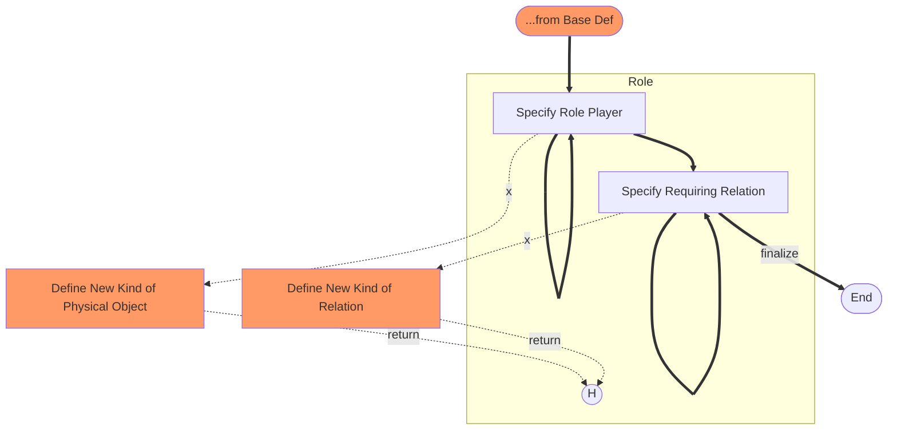

# Role Definition Modelling

```mermaid
flowchart TD
    S([...from Base Def])
    SRP[Specify Role Player]
    SRR[Specify Requiring Relation]
    DNKPO[Define New Kind of Physical Object]
    DNKR[Define New Kind of Relation]
    HIST((H))
    E([End])

    S:::external ==> SRP
    subgraph R[Role]
        SRP ==> SRP
        SRP ==> SRR
        SRR ==> SRR
        HIST
    end

    SRP -.->|x| DNKPO
    SRR -.->|x| DNKR
    DNKPO:::external -.->|return| HIST
    DNKR:::external -.->|return| HIST
    SRR ==>|finalize| E

    click DNKPO "/docs/design/theory/quintessential-modelling/modelling-procedures/physical-object-definition-model" "This is a tooltip for a link"
    click DNKR "/docs/design/theory/quintessential-modelling/modelling-procedures/relation-definition-model" "This is a tooltip for a link"
    click S "/docs/design/theory/quintessential-modelling/modelling-procedures/base-definition-model" "This is a tooltip for a link"
    
    classDef external fill:#f96
```
