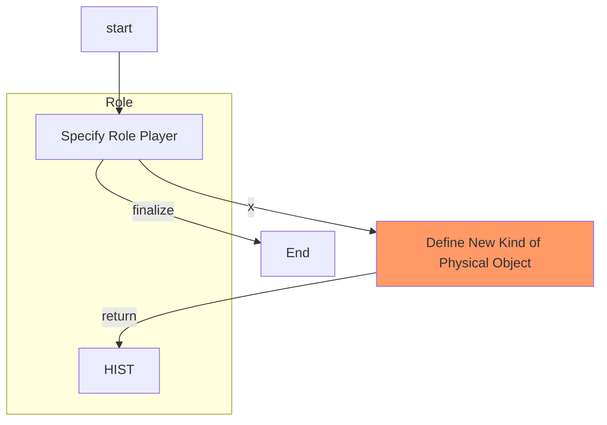

# Role Definition Modelling

```mermaid
flowchart TD
    SRP[Specify Role Player]
    DNKPO[Define New Kind of Physical Object]
    HIST
    E[End]

    start --> SRP
    subgraph R[Role]
        SRP
        HIST
    end

    SRP -->|x| DNKPO
    DNKPO:::external -->|return| HIST
    SRP -->|finalize| E

    click DNKPO "/docs/design/theory/quintessential-modelling/modelling-procedures/physical-object-definition-model" "This is a tooltip for a link"

    classDef external fill:#f96
```
