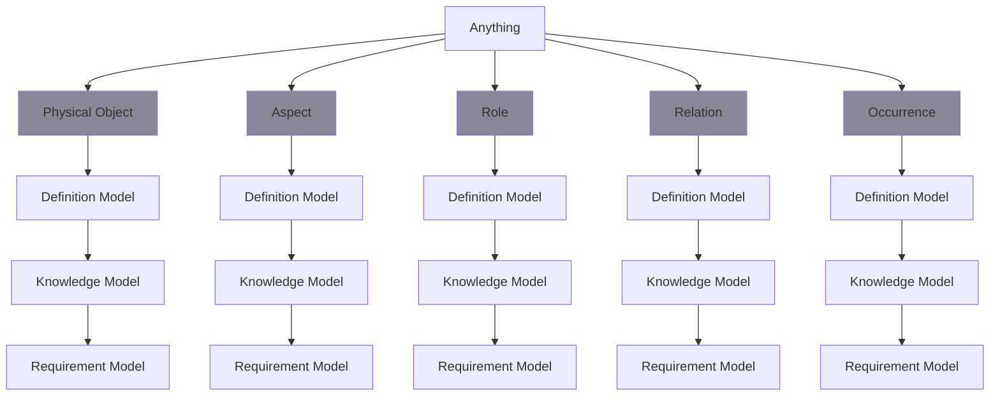

# Intro

```mermaid
graph TD;
    A[Anything]-->B[Physical Object];
    B-->BA[Definition Model]
    BA-->BB[Knowledge Model]
    BB-->BC[Requirement Model]
    A-->C[Aspect];
    C-->CA[Definition Model]
    CA-->CB[Knowledge Model]
    CB-->CC[Requirement Model]
    A-->D[Role];
    D-->DA[Definition Model]
    DA-->DB[Knowledge Model]
    DB-->DC[Requirement Model]
    A-->E[Relation];
    E-->EA[Definition Model]
    EA-->EB[Knowledge Model]
    EB-->EC[Requirement Model]
    A-->F[Occurrence];
    F-->FA[Definition Model]
    FA-->FB[Knowledge Model]
    FB-->FC[Requirement Model]
    
    style B fill:#889
    style C fill:#889
    style D fill:#889
    style E fill:#889
    style F fill:#889

    click B "https://www.github.com" "This is a tooltip for a link"
```

